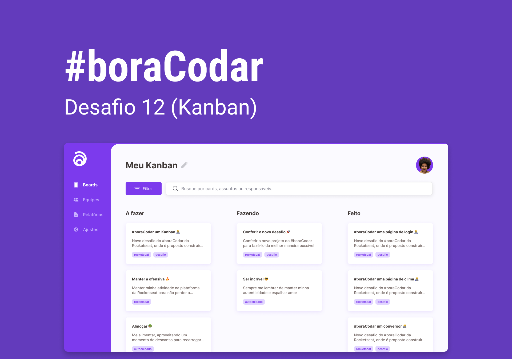

<h1 align="center"> Kanban </h1>

  <a href="#-tecnologias">Tecnologias</a>&nbsp;&nbsp;&nbsp;|&nbsp;&nbsp;&nbsp;
  <a href="#-projeto">Projeto</a>&nbsp;&nbsp;&nbsp;|&nbsp;&nbsp;&nbsp;
  <a href="#-layout">Layout</a>&nbsp;&nbsp;&nbsp;|&nbsp;&nbsp;&nbsp;
  <a href="#-todo">Melhorias</a>

 

  

## 🚀 Tecnologias

Esse projeto foi desenvolvido com as seguintes tecnologias:

- HTML e CSS
- HTML Drag and Drop API
- JavaScript
- Git e Github

## 💻 Projeto

Este projeto foi desenvolvido para o desafio semanal #boraCodar promovido pela Rocketseat. Na edição #12, a proposta foi criar um Kanban. 

Você pode visualizar o projeto através [DESSE LINK](https://viviansanchez.github.io/bora-codar-12-rocketseat/)!

## 🔖 Layout

Você pode visualizar o layout de inspiração do projeto através [DESSE LINK](https://www.figma.com/file/kRAIUiDXd5LtrwfaDMZ21h/%23boracodar---Desafio-12-(Community)?node-id=18-21&t=GlFums5p6XZD5jYf-0). É necessário ter conta no [Figma](https://figma.com) para acessá-lo.

## ⚙️ Melhorias
- Desenvolvimento da versão mobile
 
  - Meu maior foco com este projeto foi aprender a utilizar a API do HTML de Drag and Drop, então foi desenvolvido apenas na versão Desktop, de acordo com o layout do Figma. No entanto, gostaria de desenvolver uma versão mobile no futuro.